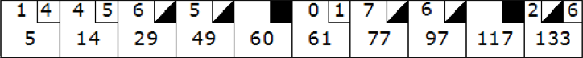

# Bowling Game TDD Kata

## What is a Kata?

Kata is a Japanese word (型 or 形) meaning "form". It refers to a detailed choreographed pattern of martial arts movements made to be practised alone.

More recently kata has come to be used in English in a more general or figurative sense, referring to any basic form, routine, or pattern of behavior that is practised to various levels of mastery.

A Kata is a term used on Development that refers to a practise for programmers to develop their skills through practice and repetition.

## TDD Kata

This is a TDD Kata, it means that the goal is to learn the mechanics of TDD.
TDD means Test Driven Development and as the name suggests the main idea is that we write a test that fulfills one of the Use Cases.
And after that we write the test that passes this requirement.
While all the tests (or use cases) are green we can ensure that the code meets all the requirements.

There are several ways to perform a TDD Kata, I would suggest using the Ping-Pong programming technique.
This requires two people to work close together by writing unit tests first and then write the code to pass them.

### Ping Pong programming steps

There are several variations of this method, the one that I like has the following steps:

1. **Person A** writes a **failing test (red)**
2. **Person B** writes the code to make the **test pass (green)**
3. **Refactor** code together if needed
4. **Person B** writes a **failing test (red)**
5. **Person A** writes the code to make the **test pass (green)**
6. **Refactor** code together if needed
7. Goto 1

Until we fulfill all the requirements for the exercise

## Bowling Kata exercise

The exercise consists on building a class that tells us the scoring for a Bowling Game.
The class has two methods, one to set the number of knocked pins given a roll and a second one that returs the current scoring.

### The bowling game

The game consists of **10 frames**.
In each frame the player has **two rolls** to knock down 10 pins.
The **score for the frame is the total number of pins knocked down**, plus bonuses for strikes and spares.

A **spare** is when the player knocks down all **10 pins in two rolls**.
The bonus for that frame is the **number of pins knocked down by the next roll**.

A **strike** is when the player knocks down all **10 pins on his first roll**.
The frame is then completed with a single roll.
The bonus for that frame is **the value of the next two rolls**.

A Strike or a Spare can also be called a mark to distinguish from an open frame.

In the **tenth frame** a player who rolls a **spare** or **strike** is allowed to **roll the extra balls to complete the frame**.
However, **no more than three balls can be rolled in tenth frame**.

## Sources

* [Wikipedia - Kata](https://en.wikipedia.org/wiki/Kata)
* [Kata Log - Bowling Kata](https://kata-log.rocks/bowling-game-kata)
* [Engineer Notebook: An Extreme Programming Episode by Robert C. Martin and Robert S. Koss](http://people.scs.carleton.ca/~jeanpier/COMP5104F06/TDD.pdf)
